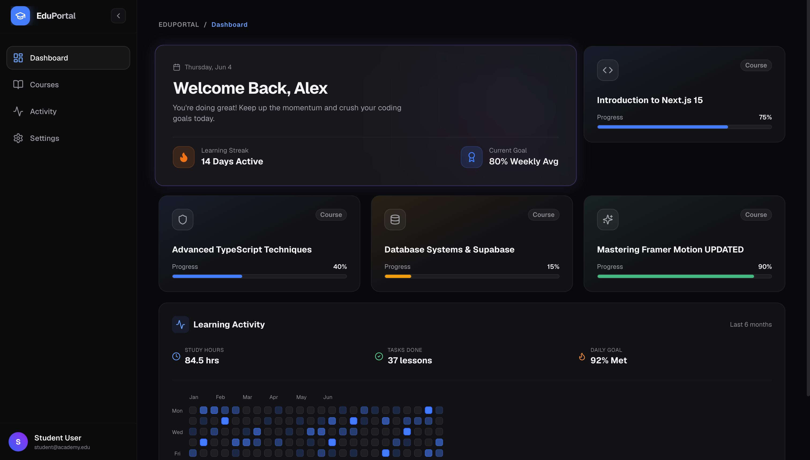
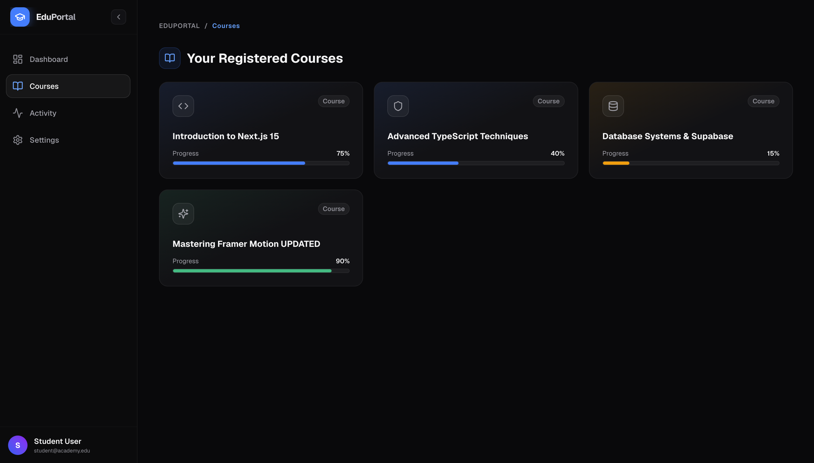
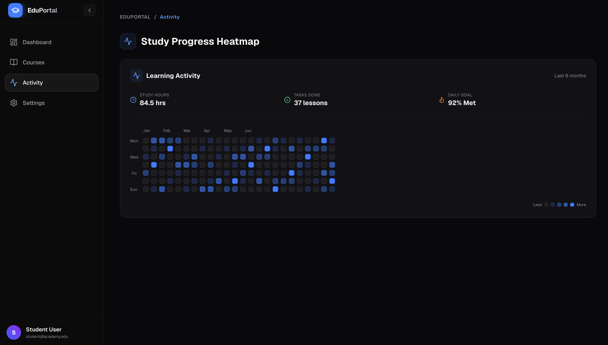

<div align="center">

# Next-Gen Learning Dashboard

**A student learning portal built with Next.js App Router, Supabase, and Framer Motion.**

[](https://nextjs.org/)
[](https://www.typescriptlang.org/)
[](https://tailwindcss.com/)
[](https://www.framer.com/motion/)
[](https://supabase.com/)
[](https://vercel.com/)

[**Live Demo →**](https://next-gen-learning-dashboard-self.vercel.app/)

</div>

---

## Overview

Next-Gen Learning Dashboard is a responsive, dark-mode learning portal that tracks student course progress and daily activity. Built as a Frontend Intern Challenge assignment, it demonstrates real architecture decisions: server-side data fetching via Next.js App Router, clean server/client component separation, physics-based animations with Framer Motion, and a Supabase PostgreSQL backend.

The UI draws from the design language of tools like Linear and Vercel — dark surfaces, precise borders, and motion that adds polish without distraction.

---

## Live Demo

[https://next-gen-learning-dashboard-self.vercel.app/](https://next-gen-learning-dashboard-self.vercel.app/)

> If Supabase credentials are not configured, the app automatically falls back to local mock data. The demo is always fully functional without any database setup.

---

## Screenshots

### Full Dashboard View


> The main dashboard showing the hero welcome card, course progress tiles, and the learning activity heatmap. The left sidebar shows the active navigation state with the Dashboard tab highlighted.

### Course Progress Cards


> Three course cards in a responsive grid. Each card shows an animated progress bar that fills from 0% to the actual value on mount. Bar colors are dynamic: blue for mid-range (40%), amber for low (15%), and green for near-complete (90%).

### Learning Activity Heatmap


> A GitHub-style contribution heatmap covering the last 6 months of daily learning activity, with summary stats: 84.5 study hours, 37 lessons completed, and 92% daily goal met.

---

## Features

- **Responsive Bento Grid** — 3-column on desktop, 2-column on tablet, single-column on mobile
- **Dark Mode UI** — Consistent dark theme with glassmorphic card surfaces and subtle border glow on hover
- **Server-Side Data Fetching** — Courses fetched in a Server Component at request time; no client-side loading flicker
- **Supabase Integration** — PostgreSQL-backed courses table; graceful mock fallback when credentials are absent
- **Animated Progress Bars** — Course completion bars animate from `0` to their actual value on mount via Framer Motion
- **Learning Activity Heatmap** — Day-level activity grid across 6 months with aggregated summary stats
- **Collapsible Sidebar** — Full sidebar on desktop, auto-collapses to icon-only on tablet, hidden on mobile
- **Mobile Bottom Navigation** — Fixed glassmorphic nav bar on mobile with sliding active-tab indicator
- **Loading Skeletons** — Custom skeleton layout matching the dashboard structure, shown during data resolution
- **Error Boundary** — Dedicated error page with description, troubleshooting steps, and a retry action

---

## Tech Stack

| Technology | Purpose |
|---|---|
| [Next.js](https://nextjs.org/) (App Router) | React framework, routing, server components |
| [TypeScript](https://www.typescriptlang.org/) | Static typing across components and data models |
| [Tailwind CSS](https://tailwindcss.com/) | Utility-first styling |
| [Framer Motion](https://www.framer.com/motion/) | Page animations, progress bar transitions, layout effects |
| [Supabase](https://supabase.com/) | PostgreSQL database |
| [Lucide React](https://lucide.dev/) | Icon set |
| [Vercel](https://vercel.com/) | Hosting and deployment |

---

## Architecture Overview

### Next.js App Router

The project uses the App Router (`src/app/`), which enables React Server Components and fine-grained control over where code runs. Routes, layouts, and error states are handled via the file system.

### Server Components

`src/app/page.tsx` is a Server Component. It queries Supabase directly on the server before any HTML is sent to the browser. This means:
- No client-side fetch waterfall
- No loading spinner on first paint
- Supabase credentials never exposed to the browser

If credentials are missing, the server logs a warning and injects mock data instead of throwing.

### Client Components

Components requiring browser interactivity or animation hooks are marked `"use client"`:

- **`DashboardClient.tsx`** — Manages active navigation tab state; conditionally renders the correct panel
- **`Sidebar.tsx`** — Controls collapse state and Framer Motion overlay indicators
- **`BentoGrid.tsx`** and card components — Run Framer Motion stagger and spring animations

### Supabase Integration

The Supabase client is initialized in `src/lib/supabase.ts` and used in the server-side data fetch. The `courses` table is the only data source. `supabase_schema.sql` contains the full table definition and sample seed data for local setup.

### Framer Motion Usage

- **Staggered page load** — `BentoGrid` uses `staggerChildren` so cards fade and shift up sequentially
- **Spring hover** — Cards scale slightly on hover using a spring transition (stiffness 300, damping 20)
- **Progress bar mount** — Width animates from `0` to the actual value using a custom ease
- **Sliding nav indicator** — Active tab highlight uses `layoutId` to slide between items without re-mounting

---

## Project Structure

```
next-gen-learning-dashboard/
├── src/
│   ├── app/
│   │   ├── error.tsx             # Error boundary with retry action
│   │   ├── loading.tsx           # Suspense loading fallback
│   │   ├── layout.tsx            # Root layout and metadata
│   │   ├── page.tsx              # Server Component — fetches courses from Supabase
│   │   └── globals.css           # Global styles
│   ├── components/
│   │   ├── ActivityCard.tsx      # Heatmap and activity stats
│   │   ├── BentoGrid.tsx         # Responsive grid with staggered animations
│   │   ├── CourseCard.tsx        # Animated course progress tile
│   │   ├── DashboardClient.tsx   # Client controller — tab state, panel switching
│   │   ├── HeroCard.tsx          # Welcome card with streak and goal stats
│   │   ├── LoadingSkeleton.tsx   # Skeleton layout matching the dashboard
│   │   └── Sidebar.tsx           # Desktop sidebar and mobile bottom nav
│   ├── lib/
│   │   └── supabase.ts           # Supabase client initialization
│   └── types/
│       └── course.ts             # TypeScript interface for course data
├── .env.example                  # Environment variable template
├── package.json
├── next.config.ts
├── postcss.config.mjs
├── eslint.config.mjs
├── supabase_schema.sql           # Table definition and seed data
├── tsconfig.json
└── README.md
```

---

## Database Schema

```sql
CREATE TABLE courses (
  id          UUID        PRIMARY KEY DEFAULT gen_random_uuid(),
  title       TEXT        NOT NULL,
  progress    INTEGER     NOT NULL CHECK (progress BETWEEN 0 AND 100),
  icon_name   TEXT        NOT NULL,
  created_at  TIMESTAMPTZ NOT NULL DEFAULT NOW()
);
```

| Column | Type | Description |
|---|---|---|
| `id` | `uuid` | Auto-generated primary key |
| `title` | `text` | Course display name |
| `progress` | `integer` | Completion percentage (0–100) |
| `icon_name` | `text` | Lucide icon component name (e.g. `"Shield"`, `"Database"`) |
| `created_at` | `timestamptz` | Row creation timestamp |

The full schema with seed data is in [`supabase_schema.sql`](./supabase_schema.sql).

---

## Installation

### Prerequisites

- Node.js 18.17 or later
- npm

### Steps

**1. Clone the repository**

```bash
git clone https://github.com/Anuragkumar-687/next-gen-learning-dashboard.git
cd next-gen-learning-dashboard
```

**2. Install dependencies**

```bash
npm install
```

**3. Configure environment variables**

```bash
cp .env.example .env.local
```

Open `.env.local` and add your Supabase credentials:

```env
NEXT_PUBLIC_SUPABASE_URL=https://your-project-id.supabase.co
NEXT_PUBLIC_SUPABASE_ANON_KEY=your-anon-key
```

> **Skip this step if you just want to run the app.** Without credentials, it falls back to mock data automatically.

**4. Set up the database (optional)**

Open the [Supabase SQL Editor](https://app.supabase.com/), paste the contents of `supabase_schema.sql`, and run it.

**5. Start the development server**

```bash
npm run dev
```

Visit [http://localhost:3000](http://localhost:3000).

---

## Environment Variables

| Variable | Description | Required |
|---|---|---|
| `NEXT_PUBLIC_SUPABASE_URL` | Supabase project URL | No — mock data used as fallback |
| `NEXT_PUBLIC_SUPABASE_ANON_KEY` | Supabase anonymous key | No — mock data used as fallback |

A template is provided in [`.env.example`](./.env.example).

---

## Deployment

The project is deployed on Vercel.

**To deploy your own copy:**

1. Fork this repository
2. Import it in the [Vercel dashboard](https://vercel.com/new)
3. Add `NEXT_PUBLIC_SUPABASE_URL` and `NEXT_PUBLIC_SUPABASE_ANON_KEY` under **Project Settings → Environment Variables**
4. Click **Deploy**

Vercel auto-detects Next.js and handles builds, previews, and production deploys on every push to `main`.

[](https://vercel.com/new/clone?repository-url=https://github.com/Anuragkumar-687/next-gen-learning-dashboard)

---

## Challenges & Solutions

**Framer Motion hydration warnings with React 19**

React 19's server rendering pass computes element positions before the client has mounted, which conflicted with Framer Motion's `layoutId` markers when placed at the page root. Moving all `AnimatePresence` wrappers and conditional renders into `"use client"` components resolved this — Framer Motion only runs after hydration is complete.

**`layoutId` conflict between desktop and mobile nav**

The desktop sidebar and mobile bottom nav both rendered a sliding active-tab indicator simultaneously in the React tree. Sharing a single `layoutId` caused the animation to jump unpredictably between both. Assigning distinct IDs (`activeHighlightDesktop` and `activeHighlightMobile`) scoped each animation to its own layout context.

**Server vs client component boundary**

Framer Motion and React state cannot run in Server Components, but moving data fetching to the client reintroduces loading states and exposes Supabase credentials. The solution is a clean handoff: `page.tsx` fetches data on the server and passes it as props to `DashboardClient.tsx`, which serves as the client boundary. All animation and interactivity lives below this boundary.

---

## Future Improvements

- [ ] Supabase Auth for multi-user support with per-user progress
- [ ] Course detail pages with lesson lists and individual completion tracking
- [ ] Light mode with system-preference detection
- [ ] Recharts-based weekly and monthly progress charts
- [ ] PWA manifest and service worker for offline access
- [ ] Playwright end-to-end tests for critical user flows

---

## Author

**Anurag Kumar** 
